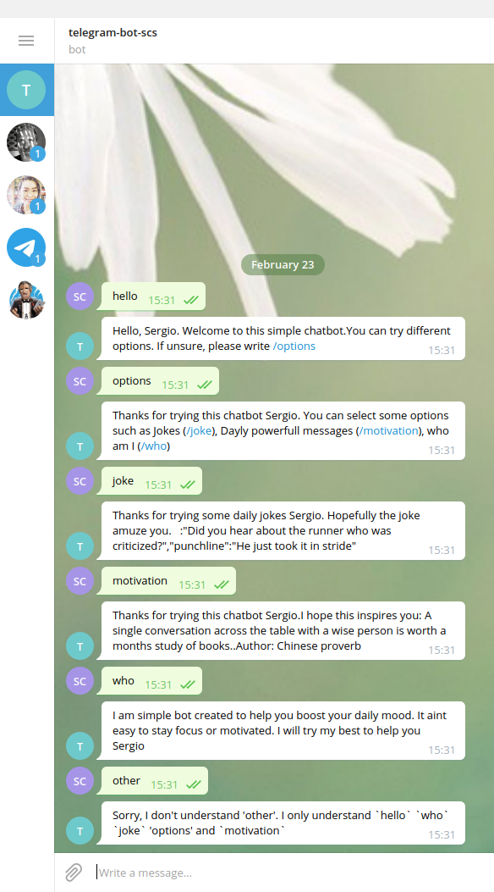

# Capstone

## Table of Contents

* [About the Project](#about-the-project)
* [Built With](#built-with)
* [Contributing](#contributing)
* [Contact](#contact)
* [Acknowledgements](#acknowledgements)

<!-- ABOUT THE PROJECT   -->
## About The Project


## Screenshot Test

<p align="center">
  
</p>

<p align="center">

</p>

### Built With

* [RUBY](https://github.com/sergiocortessat/Ruby-Rspec-Enumerables/tree/rspec)

## Contributing

Contributions are what make the open source community such an amazing place to be learn, inspire, and create. Any contributions you make are **greatly appreciated**.

## Prequisites

Ruby installed on your local machine.
telegram account
bundle installed on your machine
rspec (optional)
Terminal or similar to execute the program.


## Getting Started
This is an example of how you may give instructions on setting up your project locally. Modify this file to match your project, remove sections that don't apply. For example: delete the testing section if the currect project doesn't require testing.


## Clone project

- To get a local copy up and running follow these simple example steps.
- Clone this repository with git clone ```https://github.com/sergiocortessat/Ruby-Capstone-bot.git``` using your terminal or command line.
- Change to the project directory by entering :
```cd Ruby-Capstone-bot``` in the terminal .
- run the command ```ruby /bin main.rb```

## How to Install and use the ChatBot
1. For starter, you must have a telegram account or create one. Once you do this, please continue the next steps
2. Once you are inside your telegram app and account, go to the search bar and seek for @BotFather. This default contact is telgrams own bot-making tools. Open and start a new conversation.
3. type in the text are: '/newbot'. This is the telgrams command to get you started. Make sure to follow its intructions.
4. First, you must chooose a name for the bot. 
5. Second, you will be prompt to place a username 
6. Finally it will provide you with a hash-key token. make sure to save it.
7. The repository should be now cloned in your machine. Make sure to be inside the main folder with: cd Ruby-Capstone-bot
8. (Optional) Direct yourself to the file called token.rb and open it. Please fill the mandatory empty field 'token_key' and save the file
9. Make sure you have Bundler installed in your machine ("gem install bundler"). 
10. Enter the terminal and make sure you are located in the main-directory.
11. Enter the command 'bundle install' in your terminal. This will install the basic dependencies in the Gemfile.
12. Once this is done, run the comman ruby bin/main.rb in your temrinal. This should start the bot.
13. Please make sure to read the instructions. Enter 'Y' if you want to enter manually your token key. Otherwise pres 'N' (Warning: If you select 'N' Make sure to have   the token saved in the file token.rb. Read step 8)
14. If you have correctly entered your token key in the terminal or in the token.rb file, the bot should be running and ready to use. Please dont close it.
15. Please direct yourslef to Telegram once again and search for the unsername you gave to the bot (you can click on the link given by FatherBot).
16. Start a conversation. Please use commands 'hello', 'options', 'jokes','motivation' or 'who'

- 'hello' will prompt a nice wlecome message.
-'who' will provide some basic info about the bot itself.
- 'options' will provide all options available for the bot
- 'joke' will provide you with daily jokes
- 'motivation' will provide wonderfull random quotes for you

You can autonosmouly alter the messages and commands in bot.rb to something you prefer.

## Testing
In this project the testing was done using RSpec to test all enumerable  methods.

## Install
- In a terminal window type gem install rspec
- Once rspec install has finished, type rspec --init
- You will see a folder spec and a file .rspec
- Inside spec folder you'll see a spec_helper.rb file.

## Run
The testing file is included in spec folder under rspec_enumerables.rb.
- go to the folder spec: 
- cd spec
- Inside your terminal type: 
- rspec spec_enumerables.rb
- All test should pass and you shall see:

 - `50 examples, 0 failures` for spec_enumerable.rb
 

## Authors

👤 Sergio Cortes Satizabal

- Github: [@sergiocortessat](https://github.com/sergiocortessat)
- Twitter: [@sergiocortessat](https://twitter.com/sergiocortessat)


Project Link: [Ruby-capstone](https://github.com/sergiocortessat/Ruby-Rspec-Enumerables/issues/2)


<!-- ACKNOWLEDGEMENTS -->
## Acknowledgements

* [Microverse](https://www.microverse.org/)


